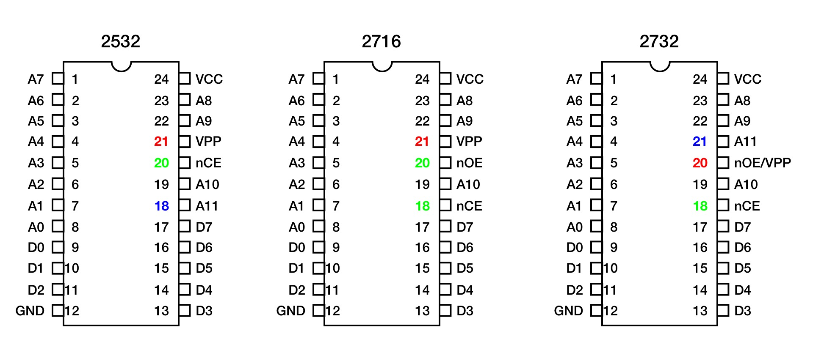
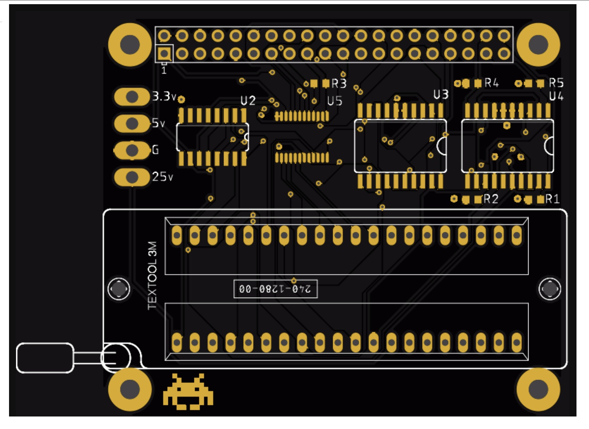

# rom-hat

* Most ROM programmers that support vintage ROMs require PC hardware that doesn't readily exist - LPT ports and DOS.
* The ubiquitious TL866 doesn't support the high voltages, long programming cycles and high currents required of vintage EEPROMs.

## The ROM hat
* Convenient Raspberry Pi Hat style form factor.
* Uses an eight bit shift register as both an IO expander and 5V level shifter for the ROM address lines. 
* A real bi-directional level shifter for the ROM's data pins.
* An analog mux supporting the ROM's high voltages and current.
* Simple C program driver program used directly on the Pi's command line.
* Supports several vintage classic arcade machines ROMs - like those in PacMan and Donkey Kong.

