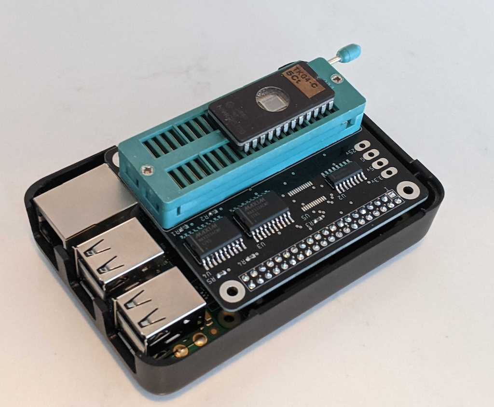

# Vintage 2532 arcade ROM programmer for Raspberry Pi

* Most ROM programmers that support vintage ROMs require old PC hardware and interfaces like ISA, LPT ports that are no longer readily available.
* USB based programmers like the TL866 don't support the high voltages, long programming cycles and high currents required of vintage EEPROMs.

* Convenient Raspberry Pi Hat style form factor.
* Uses an eight bit shift register as both an IO expander and 5V level shifter to interface ROM address lines. 
* A real bi-directional level shifter for the ROM's data pins.
* An analog mux supporting the ROM's full high voltages and current.
* Simple C driver program used directly on the Pi's command line.
* [Smart single-byte retry algorithm](https://www.youtube.com/watch?v=HBokTF31uQM) accounts for difficult to program adddresses and lower VPP voltages.
* Supports several vintage classic arcade machine ROMs - like those in Space Invaders, Donkey Kong and Pacman.

